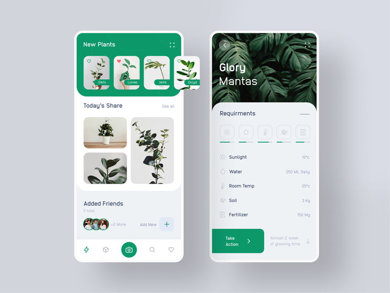

<h1 align="center">
    
</h1>

<p align="center">
  <a href="#technologies">Technologies</a>&nbsp;&nbsp;&nbsp;|&nbsp;&nbsp;&nbsp;
  <a href="#-project">Project</a>&nbsp;&nbsp;&nbsp;|&nbsp;&nbsp;&nbsp;
  <a href="#-layout">Layout</a>&nbsp;&nbsp;&nbsp;|&nbsp;&nbsp;&nbsp;
  <a href="#-layout">Getting started</a>&nbsp;&nbsp;&nbsp;|&nbsp;&nbsp;&nbsp;
  <a href="#-license">License</a>
</p>

<p align="center">
  
  
       

  
</p>

<br>

<p align="center">
  
</p>

---

## 🧪 Technologies

This project was developed using the following technologies:

- [React Native](https://reactnative.dev/)
- [Expo](https://expo.io/)
- [TypeScript](https://www.typescriptlang.org/)

## 💻 Project

We are going to build a beautiful Plant App based on the design created by Soumitro on Dribbble. 🌱

## 🔖 Layout

The "Plant App Exploration" was based on the design created by Soumitro on Dribbble.

You can view the project layout through the links below:

- [Layout](https://dribbble.com/shots/6910440-Plant-App-Exploration)

## 🚀 Getting started

Clone the project and access the folder

```bash
$ git clone https://github.com/JosiasSilvestre/Plant-App-Exploration.git && cd Plant-App-Exploration
```

Follow the steps below
```bash
# Install the dependencies
$ yarn install

# Start the project
$ expo start
```

## 📝 License

This project is licensed under the MIT License. See the [LICENSE](LICENSE.md) file for details.


---

Made with 💜 by [Josias Silvestre](https://github.com/JosiasSilvestre)
